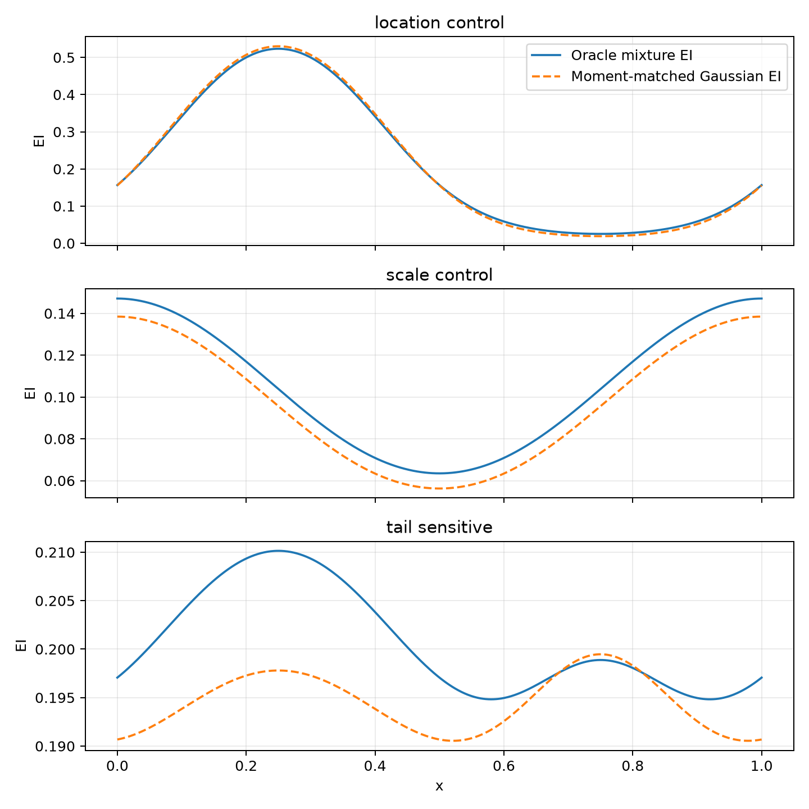

# Task 01 — Oracle and q=1 GP validation

This repository's first stage asks a deliberately narrow question: can a small,
properly normalized residual energy add decision-relevant predictive shape beyond a
moment-matched Gaussian, and does augmented expected-utility inference reproduce the
usual q=1 GP decision rule? The answer is **yes for these mathematical/oracle checks**.
It is not evidence of end-to-end BO superiority, and it does not implement Task 02.

## Key findings

The local smoke run used three fitting seeds (`0, 1, 2`), residual sample sizes
`20, 50, 100, 200, 500`, a fixed 20,000-sample holdout set, CPU double precision, and
a nine-RBF residual energy with 64-point Gauss–Hermite normalization.

| Question | Result |
| --- | --- |
| Does shape matter with matched mean/variance? | In the predeclared tail-sensitive scenario, oracle EI selects `x=0.250` while Gaussian EI selects `x=0.750`; Spearman rank correlation is `0.53116` and top-5% overlap is `0.000`. |
| Does residual energy beat a fair Gaussian baseline? | Yes on mean held-out log score and KL at every tested sample size, against Gaussian location/scale MLE. |
| Is that only a moment correction? | No: fitted residual moments can move at finite sample size, but the model still improves over the fitted location/scale Gaussian. |
| Does augmented inference recover expected utility? | Uniform-prior normalized-marginal errors for `M=1,2,4` are `1.11e-15`, `1.55e-15`, and `3.33e-15`; the mode is preserved under replicated sharpening. |
| Does q=1 GP augmentation recover EI/LogEI? | Yes: analytic-vs-quadrature EI discrepancy is `9.71e-17`, augmented-vs-EI marginal discrepancy is `1.60e-14`, and EI, LogEI, and augmented modes agree at `x=0.303`. |
| Is simple particle inference already practical? | No for larger replica count: ESS fractions at 30,000 particles are `0.2165`, `0.0432`, and `0.0013` for `M=1,2,4`. |

### Residual energy versus Gaussian location/scale MLE

| Residual samples | Gaussian MLE log score | EBM log score | Gaussian MLE KL | EBM KL |
| --- | ---: | ---: | ---: | ---: |
| 20 | -1.55891 | -1.42100 | 0.15801 | 0.01868 |
| 50 | -1.45040 | -1.41692 | 0.04839 | 0.01418 |
| 100 | -1.42974 | -1.41507 | 0.02818 | 0.01304 |
| 200 | -1.42067 | -1.41337 | 0.01843 | 0.01067 |
| 500 | -1.41537 | -1.40679 | 0.01326 | 0.00446 |

## Interpretation and next stage

- The residual density is scalar, context-free, and explicitly normalized. Its RBF
  basis is reference-centered to fix the additive-energy gauge; no neural EBM,
  Vecchia, SAAS, DKL, q>1 batch BO, or acquisition-aware training is included.
- The oracle and GP identities pass, but M=4 raw-weight degeneration is a genuine
  negative result. The next justified research priority is **both** exact-GP corrected
  prequential training and annealed SMC for augmented inference.
- Do not describe these results as novelty or as a performance advantage over existing
  BO methods. The planned 30-seed follow-up is for reproducibility, not a completed
  local result.

## Reproduce or inspect

- Detailed per-check evidence: [reports/TASK_01_SMOKE.md](reports/TASK_01_SMOKE.md)
- Reusable implementation: [src/energy_bo](src/energy_bo)
- Mathematical tests: [tests](tests)
- Local quick start: `uv sync --python 3.12 --all-groups && uv run pytest`
- Larger 30-seed Colab procedure: [COLAB.md](COLAB.md)

Generated CSV/JSON diagnostics remain ignored under `artifacts/`; the figure above is
the sole checked-in generated asset and comes from the validated three-seed smoke run.
